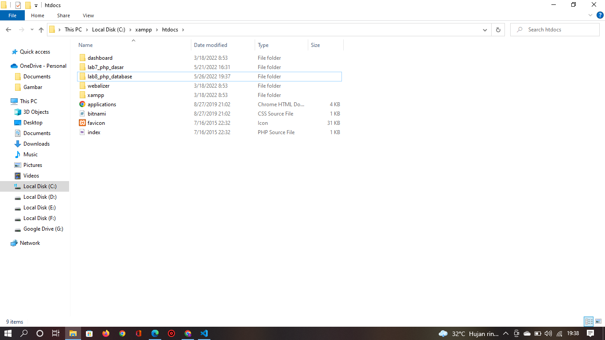

# Lab8Web

## Nama : Prananda Aditya

## NIM : 312010130

## Kelas : TI.20.A1

## Mata Kuliah : Pemograman Web

# Langkah - langkah Praktikum

## Persiapan

<br>Untuk memulai membuat aplikasi CRUD sederhana, yang perlu disiapkan adalah server menggunakan MySQL. Pastikan MySQL Server sudah dapat dijalankan melalui Xampp.

# 1. Menjalankan MySQL

<br>Untuk Menjalankan MySQL server dari menu XAMPP control.


## Mengakses MySQL Client menggunakan PHP Myadmin

<br>Pastikan webserver Apache dan MySQL server sudah dijalankan. Kemudian buka Browser: http://localhost/phpmyadmin/


# 2. Membuat Database: Studi Kasus Data Barang


## Membuat Database

```
CREATE DATABASE latihan1;
```


## Membuat Tabel

```
CREATE TABLE data_barang (
 id_barang int(10) auto_increment Primary Key,
 kategori varchar(30),
 nama varchar(30),
 gambar varchar(100),
 harga_beli decimal(10,0),
 harga_jual decimal(10,0),
 stok int(4)
);
```


## Menambahkan data

```
INSERT INTO data_barang (kategori, nama, gambar, harga_beli, harga_jual, stok)
VALUES ('Elektronik', 'HP Samsung Android', 'hp_samsung.jpg', 2000000, 2400000, 5),
('Elektronik', 'HP Xiaomi Android', 'hp_xiaomi.jpg', 1000000, 1400000, 5),
('Elektronik', 'HP OPPO Android', 'hp_oppo.jpg', 1800000, 2300000, 5);
```


## Membuat Program CRUD

<br>Buat folder lab8_php_database pada root directory web server (d:/xampp/htdocs)

<br>Kemudian untuk mengakses direktory tersebut pada web server dengan mengakses URL: http://localhost/lab8_php_database/


## Membuat File koneksi database

<br>buat file baru dengan nama koneksi.php

```
<?php
$host = "localhost";
$user = "root";
$pass = "";
$db = "latihan1";
$conn = mysqli_connect($host, $user, $pass, $db);
if ($conn == false)
{
 echo "Koneksi ke server gagal.";
 die();
} else echo "Koneksi berhasil";
?>
```

<br>Buka melalui browser untuk menguji koneksi database (untuk menyampilkan pesan koneksi berhasil, uncomment pada perintah echo"koneksi berhasil";


## Membuat File index untuk menampilkan data(Read)

<br>Buat File baru dengan nama index.php

```
<?php
include("koneksi.php");
// query untuk menampilkan data
$sql = 'SELECT * FROM data_barang';
$result = mysqli_query($conn, $sql);
?>
<!DOCTYPE html>
<html lang="en">
<head>
<meta charset="UTF-8">
 <link href="style.css" rel="stylesheet" type="text/css" />
 <title>Data Barang</title>
</head>
<body>
 <div class="container">
 <h1>Data Barang</h1>
 <div class="main">
 <table>
 <tr>
 <th>Gambar</th>
 <th>Nama Barang</th>
 <th>Katagori</th>
 <th>Harga Jual</th>
 <th>Harga Beli</th>
 <th>Stok</th>
 <th>Aksi</th>
 </tr>
 <?php if($result): ?>
 <?php while($row = mysqli_fetch_array($result)): ?>
 <tr>
 <td>" alt="<?=
$row['nama'];?>"></td>
 <td><?= $row['nama'];?></td>
 <td><?= $row['kategori'];?></td>
 <td><?= $row['harga_beli'];?></td>
 <td><?= $row['harga_jual'];?></td>
 <td><?= $row['stok'];?></td>
 <td><?= $row['id_barang'];?></td>
 </tr>
 <?php endwhile; else: ?>
 <tr>
 <td colspan="7">Belum ada data</td>
 </tr>
 <?php endif; ?>
 </table>
 </div>
 </div>
</body>
</html>
```
